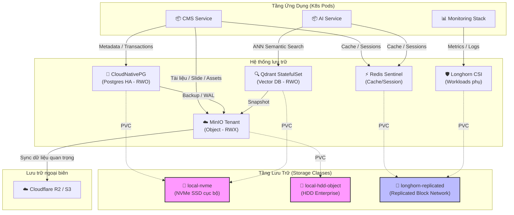
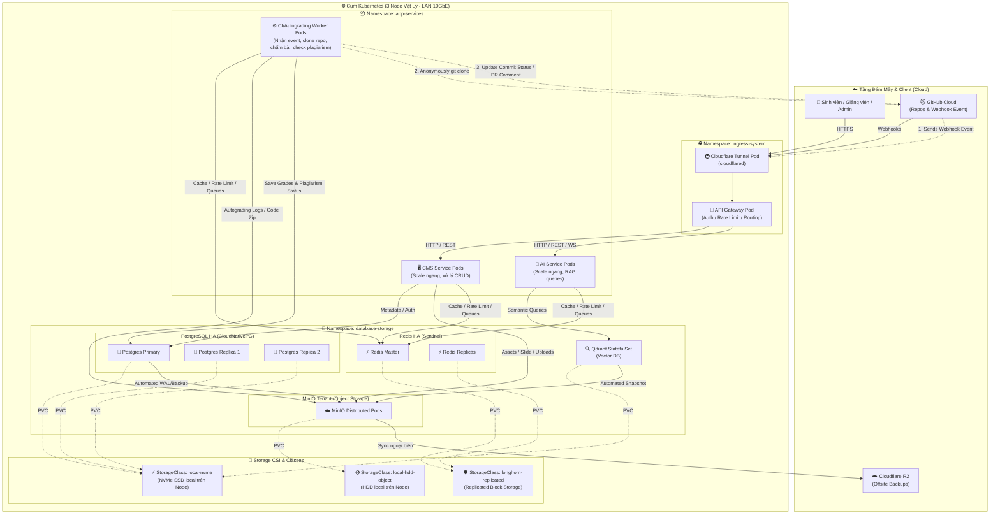

# 1. Tìm hiểu Ops và cách chia cluster
Do hệ thống thiên về AI nên tải sẽ không đều. Web/API có thể scale ngang, nhưng database, vector database, object storage và queue phải được thiết kế ổn định hơn. Tim hiểu cách chia cluster thành các lớp:
- Edge layer: load balancer, reverse proxy, rate limiting.
- Web/API layer: scale ngang nhiều replica.
- AI worker layer: xử lý LLM, tutor, guardrails.
- RAG worker layer: parse tài liệu, embedding, indexing.
- Data layer: PostgreSQL, vector DB, object storage, Redis/queue.
- CI/autograding layer: tách riêng để việc chạy test code sinh viên không ảnh hưởng hệ thống chính.
- Monitoring layer: log, metrics, tracing, alert.

Mục tiêu là xác định service nào cần scale ngang, service nào cần chạy ổn định/high availability, service nào nên xử lý bất đồng bộ qua queue.

## 1.1. Context
- Giả định hệ thống chạy trên server, chỉ giới hạn cho sinh viên trong trường sử dụng.
- Ứng tính quy mô:
    - Khi cao điểm có thể có khoảng 2000-3000 user active, 200-300 req/s.
    - Database: khoảng vài chục GB, chủ yếu là tài liệu, embedding và user info.
    - Trước mắt triển khai trên 3 môn học pivot là Học máy, Học sâu và Khai phá dữ liệu lớn.
- Dự tính triển khai chính trên Kubernetes vì khả năng co giãn và quản lý tài nguyên tốt.

## 1.2. Kiến trúc hệ thống
### 1.2.1. Layer 1: Tầng mạng


### 1.2.2. Layer 2: Tầng ứng dụng

#### Phía Frontend
Chia làm 3 site độc lập ứng với 3 vai trò (role):
*   **Admin**: Quản trị hệ thống, quản lý môn học, người dùng, phân phối bài tập (assignments),...
*   **User**: Học sinh, sinh viên tham gia học tập và tương tác với AI.
*   **Tutor**: Giảng viên, trợ giảng quản lý lớp học, chấm điểm và cấu hình trợ lý ảo cho môn học.

#### Phía Backend (So sánh phương án phân chia)

| Tiêu chí | **Chia theo Role** (admin-be / tutor-be / user-be) | **Chia theo Tính năng** (CMS Service / AI Service) |
| :--- | :--- | :--- |
| **Nguyên tắc phân chia** | Dựa trên **đối tượng sử dụng** | Dựa trên **domain nghiệp vụ** |
| **Độc lập deploy** | ✅ Deploy riêng từng role | ✅ Deploy riêng từng tính năng |
| **Khả năng Scale** | ⚠️ Scale theo role → dễ dư thừa tài nguyên nếu user-be vừa xử lý nghiệp vụ thông thường vừa tải AI nặng | ✅ Scale AI Service độc lập khi nhu cầu tính toán AI/Vector Search tăng cao |
| **Tái sử dụng logic** | ❌ Logic nghiệp vụ bị trùng lặp nhiều giữa các role (ví dụ: xem khóa học có ở cả tutor & user) | ✅ Logic tập trung theo domain, tái sử dụng cao, tránh lặp mã nguồn |
| **Phân quyền (AuthZ)** | ✅ Rõ ràng theo role ngay từ tầng service | ⚠️ Cần xử lý phân quyền tập trung tại API Gateway hoặc phân rã logic trong service |
| **Độ phức tạp** | ⚠️ Nhiều service nhỏ nhưng logic bên trong mỗi service đơn giản hơn | ✅ Ít service hơn, nhưng mỗi service gộp nhiều vai trò nên cần thiết kế module tốt |
| **Phù hợp với team nhỏ** | ❌ Phải duy trì và vận hành 3 repository/pipeline riêng biệt | ✅ Chỉ cần vận hành

### 1.2.3. Layer 3: Tầng dữ liệu (Database & Storage)

Ở mốc triển khai 5 năm, hệ thống được thiết kế theo hướng **tự host trên cụm Kubernetes (On-premise)**. Mỗi loại dữ liệu với đặc tính riêng sẽ được lưu trữ bởi các giải pháp chuyên dụng:

*   **File Storage (Tài liệu, slide, bài nộp)**: Cần dung lượng lớn, hỗ trợ chia sẻ đa node.
*   **PostgreSQL**: Cần tính nhất quán cao, hỗ trợ HA, backup và khôi phục tự động.
*   **Redis**: Cần tốc độ cực cao để lưu cache/session/rate limit tạm thời.
*   **Vector Database**: Cần độ trễ cực thấp và I/O đĩa cực lớn để phục vụ tìm kiếm ngữ nghĩa RAG.



---

#### 1.2.3.1. File Storage (MinIO)

*   **Giải pháp chọn**: **MinIO Operator + Distributed MinIO Tenant** (tương thích S3 API).
*   **Thiết kế lưu trữ**: Backend không ghi file lên ổ đĩa cục bộ mà lưu metadata vào PostgreSQL và đẩy file vật lý sang MinIO.
*   **Lý do chọn & Điểm nổi bật**:
    *   Hỗ trợ truy cập đa node (**ReadWriteMany - RWX**) qua HTTP API, giúp Backend pod scale ngang thoải mái.
    *   Cơ chế **Erasure Coding** phân tán dữ liệu trên nhiều đĩa/máy chủ giúp tự phục hồi khi hỏng đĩa hoặc sập node.
    *   Dễ dàng chuyển đổi sang các dịch vụ S3 Cloud (Cloudflare R2, AWS S3) sau này mà không cần sửa code.
    *   Làm kho lưu trữ tập trung cho các bản backup PostgreSQL và snapshot của Vector Database.
*   **Cấu hình dự kiến**:
    *   *Dung lượng*: 3 – 6 TB raw (slide, bài nộp, logs, backups).
    *   *Mô hình*: Distributed chạy trên 3 node vật lý.
    *   *Cấu hình mỗi node*: 1 – 2 × HDD Enterprise 8 TB (sử dụng StorageClass `local-hdd-object`).

---

#### 1.2.3.2. PostgreSQL (CloudNativePG)

*   **Giải pháp chọn**: **CloudNativePG Operator** (1 Primary + 2 Replicas).
*   **Lý do chọn & Điểm nổi bật**:
    *   Quản lý PostgreSQL chuẩn Cloud-Native: tự động hóa replication, phát hiện và failover node Primary lỗi trong <1 phút.
    *   Tự động backup dữ liệu và WAL (Write-Ahead Logging) trực tiếp lên cụm MinIO nội bộ, hỗ trợ Point-in-Time Recovery (PITR).
    *   *Tại sao không dùng Longhorn làm chính cho PostgreSQL?* PostgreSQL production cần HA và phục hồi ở tầng database (do CloudNativePG quản lý) thay vì chỉ nhân bản vật lý thô ở tầng block storage (Longhorn). Longhorn chỉ dùng cho đĩa phụ của các workload không nhạy cảm độ trễ.
*   **Cấu hình dự kiến**:
    *   *Dung lượng dữ liệu*: 100 – 300 GB.
    *   *Tài nguyên/Pod*: 2 – 4 core CPU, 8 – 16 GB RAM (Limit: 16 – 32 GB RAM).
    *   *Lưu trữ*: PVC 300 – 500 GB cho mỗi instance sử dụng StorageClass `local-nvme` (đĩa NVMe SSD vật lý gắn trực tiếp trên node máy chủ để tối đa hóa IOPS).

---

#### 1.2.3.3. Redis (Sentinel / Cluster)

*   **Giải pháp chọn**: **Redis Sentinel** (1 Master + 2 Replicas + 3 Sentinels) đảm bảo HA ở quy mô vừa phải.
*   **Lý do chọn**: Tốc độ truy xuất mili-giây trên RAM để lưu session, refresh token, rate limit và cache kết quả SQL thường truy vấn, giảm tải tối đa cho PostgreSQL.
*   **Cấu hình dự kiến**:
    *   *Tài nguyên/Pod*: 500m – 1 core CPU, 2 – 4 GB RAM.
    *   *Lưu trữ*: 20 – 50 GB PVC dùng StorageClass `longhorn-replicated` hoặc `local-ssd` (bật AOF/RDB persistence). Dữ liệu chỉ mang tính chất cache/session, dữ liệu gốc luôn nằm ở PostgreSQL.

---

#### 1.2.3.4. Vector Database (Qdrant)

*   **Giải pháp chọn**: **Qdrant StatefulSet** chạy trên **Local PV/NVMe**.
*   **Lý do chọn & Điểm nổi bật**:
    *   Đơn giản và nhẹ hơn rất nhiều so với Milvus (không cần các thành phần phụ trợ phức tạp như message queue, metadata store), phù hợp với đội vận hành nhỏ.
    *   *Tại sao dùng Local PV/NVMe?* Tìm kiếm vector (ANN Search) yêu cầu độ trễ cực thấp và I/O đĩa rất lớn. Đặt Vector DB trên network block storage (như Longhorn) qua mạng LAN 1Gbps sẽ gây nghẽn băng thông nghiêm trọng. Qdrant bắt buộc phải truy xuất trực tiếp ổ đĩa NVMe cục bộ để đạt hiệu năng tối ưu.
*   **Cấu hình dự kiến**:
    *   *Dung lượng index*: 50 – 150 GB (khoảng 5.000.000 vectors).
    *   *Tài nguyên/Pod*: 2 – 4 core CPU, 8 – 16 GB RAM (Limit: 32 – 64 GB RAM để Qdrant load cache index vào RAM).
    *   *Lưu trữ*: PVC 500 GB – 1 TB dùng StorageClass `local-nvme` (Enterprise NVMe SSD gắn trực tiếp).
    *   *Backup*: Snapshot định kỳ và tự động upload lên MinIO.

---

#### 1.2.3.5. Block Storage phụ (Longhorn)

*   **Giải pháp chọn**: **Longhorn CSI**.
*   **Mục đích sử dụng**: Cấp PVC có nhân bản (replication) cho các workload phụ, không nhạy cảm độ trễ I/O (Monitoring stack Prometheus/Grafana, Dev/Staging DBs, Dashboard metadata). Tuyệt đối **không dùng** Longhorn cho đĩa dữ liệu của MinIO, PostgreSQL chính và Qdrant production.
*   **Cấu hình**: Chế độ Replication = 2 hoặc 3 tùy số node vật lý, sử dụng StorageClass `longhorn-replicated`.

---

#### 1.2.3.6. Chiến lược Backup và Khôi phục

Quy trình backup đa tầng tự động đảm bảo khả năng khôi phục nhanh khi xảy ra thảm họa phần cứng:

1.  **PostgreSQL**: CloudNativePG tự động backup hàng ngày + lưu trữ WAL archive liên tục lên cụm MinIO nội bộ.
2.  **Vector DB**: Qdrant snapshot tự động đẩy lên cụm MinIO.
3.  **Offsite Backup**: Các dữ liệu quan trọng nhất (MinIO buckets chứa code/bài nộp của sinh viên, snapshot Qdrant, base backup PostgreSQL) được định kỳ đồng bộ ngoại biên sang **Cloudflare R2** hoặc **S3-compatible Cloud Storage**.
    *   *RPO mục tiêu*: Từ vài phút đến vài giờ tùy loại dữ liệu.
    *   *RTO mục tiêu*: 15 – 60 phút đối với PostgreSQL; 2 – 4 tiếng đối với dữ liệu Object lớn.

---

#### 1.2.3.7. Cấu hình phần cứng Node tổng thể (Cụm 3 Node vật lý)

Cấu hình tối thiểu đề xuất cho **mỗi node máy chủ vật lý** trong cụm Kubernetes để chạy mượt mà toàn bộ Data Layer mốc 5 năm:

*   **CPU**: 16 – 32 core.
*   **RAM**: 128 GB.
*   **Disk hệ điều hành (OS)**: 1 × SSD 512 GB.
*   **Disk dữ liệu nóng (Hot Data)**: 1 × Enterprise NVMe SSD 1.92 TB (sử dụng cho StorageClass `local-nvme` của PostgreSQL và Qdrant).
*   **Disk lưu trữ đối tượng (Object/Archive)**: 1 – 2 × HDD Enterprise 8 TB (sử dụng cho StorageClass `local-hdd-object` của MinIO).
*   **Mạng**: Kết nối mạng nội bộ tối thiểu **10GbE** (khuyến nghị) hoặc 2.5GbE để đồng bộ dữ liệu Longhorn/MinIO nhanh chóng.

---
## 1.3. Gitea Self-host vs GitHub API: Tích hợp Git cho sinh viên

Khi xây dựng hệ thống AI Teaching Assistant, nhóm có hai hướng chính để quản lý mã nguồn bài nộp của sinh viên: **tự host Gitea** hoặc **tận dụng GitHub API/Webhook**. Về bản chất, phần Git chỉ đảm nhiệm lưu trữ repository và phát sinh sự kiện khi sinh viên nộp bài; các phần nặng như CI/autograding, AI review, sandbox, kiểm tra similarity và lưu kết quả vẫn do hệ thống Kubernetes của trường tự xử lý.

### 1.3.1. So sánh ngắn gọn

| Tiêu chí | Gitea Self-host | GitHub API / Webhook |
|---|---|---|
| Mô hình | Trường tự triển khai Git server trên hạ tầng riêng | Tận dụng hạ tầng GitHub để lưu repository |
| Chi phí Git hosting | Tốn server, storage, backup, monitoring, vận hành | Gần như không phải vận hành hạ tầng Git |
| Portfolio sinh viên | Hạn chế nếu repo nội bộ | Rất tốt, sinh viên có GitHub repo để đưa vào CV |
| Tích hợp hệ thống | Có webhook/API, chủ động cao | Có webhook/API đầy đủ, dễ tích hợp với backend |
| Kiểm soát dữ liệu | Cao, phù hợp bài thi/bài private | Phụ thuộc GitHub, repo public cần cân nhắc dữ liệu |
| Vận hành | Cần tự backup, cập nhật, bảo mật, scale disk | GitHub xử lý uptime, storage, băng thông Git |
| Phù hợp với PBL | Dùng được nhưng ít giá trị portfolio | Rất phù hợp với project-based learning |
| Rủi ro sao chép | Thấp hơn nếu dùng private repo | Cao hơn nếu public, nhưng có thể kiểm soát bằng demo, commit history, similarity check và vấn đáp |

---

### 1.3.2. Lý do chọn GitHub API/Webhook

Nhóm đề xuất chọn **GitHub API/Webhook** làm phương án chính vì phù hợp hơn với định hướng **“đứng trên vai người khổng lồ”**: tận dụng hạ tầng GitHub thay vì tự xây và vận hành Git server.

Thứ nhất, GitHub giúp giảm đáng kể chi phí và công sức vận hành. Nếu dùng Gitea, nhà trường phải tự lo server, dung lượng repository, backup, bảo mật, monitoring và xử lý sự cố. Với GitHub, phần Git hosting gần như được chuyển sang nền tảng có sẵn, còn hạ tầng Kubernetes của trường chỉ tập trung vào các thành phần cốt lõi như AI review, autograding, RAG, database và dashboard.

Thứ hai, GitHub mang lại giá trị trực tiếp cho sinh viên. Các project public có thể trở thành portfolio thật khi sinh viên đi thực tập hoặc xin việc. Sinh viên cũng được làm quen với quy trình phát triển phần mềm phổ biến trong thực tế như commit, branch, Pull Request, issue và review.

Thứ ba, GitHub Webhook giúp backend không cần polling liên tục. Khi sinh viên `push code` hoặc tạo Pull Request, GitHub sẽ gửi event về API Gateway của trường. Backend đưa event vào queue, worker nội bộ clone đúng commit, chạy test, AI review, kiểm tra similarity và lưu kết quả. Sau đó hệ thống chỉ gọi GitHub API để cập nhật trạng thái hoặc comment kết quả vào Pull Request.

Luồng tổng quát:

```txt
Student push code / Pull Request
        ↓
GitHub Webhook
        ↓
API Gateway của trường
        ↓
Queue
        ↓
CI / AI Review Worker trong Kubernetes
        ↓
PostgreSQL / MinIO lưu kết quả
        ↓
GitHub API cập nhật status/comment
````

Thứ tư, trong project-based learning, việc sinh viên tham khảo hoặc tái sử dụng code không nhất thiết là xấu. Điều quan trọng là sinh viên có hiểu, tùy biến, tích hợp và bảo vệ được sản phẩm hay không. Vì vậy, GitHub public repo phù hợp với tinh thần học mở, đồng thời hệ thống vẫn có thể đánh giá công bằng thông qua commit history, demo, vấn đáp, kết quả CI và similarity check.

### 1.3.3. Kết luận

Phương án được chọn là:

```txt
GitHub API/Webhook làm Git hosting chính
CI/autograding và AI review chạy trong Kubernetes của trường
Gitea chỉ dùng làm phương án phụ cho bài thi, bài kiểm tra hoặc repo cần private tuyệt đối
```

Tóm lại, GitHub API giúp hệ thống giảm gánh nặng vận hành Git, tăng giá trị portfolio cho sinh viên và phù hợp hơn với mô hình project-based learning. Gitea vẫn có giá trị trong các trường hợp cần kiểm soát nội bộ tuyệt đối, nhưng không nên là lựa chọn chính nếu mục tiêu là mở rộng, tiết kiệm chi phí và tận dụng hạ tầng có sẵn.

## 1.4. Sơ đồ triển khai hệ thống (Deployment Diagram)

Dưới đây là sơ đồ triển khai toàn diện của hệ thống **AI Teaching Assistant Platform**, được phân bổ theo cụm Kubernetes nội bộ (On-premise 3-Node) kết hợp với các dịch vụ Cloud bổ trợ (Cloudflare, GitHub). Sơ đồ thể hiện cách các lớp (Layer 1 - Mạng, Layer 2 - Ứng dụng, Layer 3 - Dữ liệu) kết nối và vận hành thực tế.



---

### 1.4.1. Giải thích luồng hoạt động chính (Workflow)

#### 1. Luồng Người Dùng & Quản Trị (Admins/Tutors/Students)
*   Người dùng truy cập qua Domain của trường -> được bảo vệ bởi **Cloudflare (DNS/SSL/DDoS)**.
*   Request đi qua **Cloudflare Tunnel (cloudflared)** được mã hóa an toàn đến cụm K8s nội bộ mà không cần mở port public trên router của trường.
*   **API Gateway** tiếp nhận request, thực hiện xác thực (JWT Auth), kiểm soát tần suất (Rate Limiting) và điều phối traffic đến đúng service tương ứng: nghiệp vụ quản lý (**CMS Service**) hoặc tính năng trợ lý học tập (**AI Service**).

#### 2. Luồng Nộp Bài & Tự Động Chấm Điểm (Autograding & Plagiarism Workflow)
1.  Sinh viên thực hiện `git push` bài làm hoặc tạo Pull Request trên GitHub.
2.  **GitHub Cloud** gửi sự kiện (Webhook) chứa thông tin commit về API Gateway thông qua Cloudflare Tunnel.
3.  API Gateway đẩy task chấm bài vào hàng đợi trong **Redis Sentinel (Queue)**.
4.  **CI/Autograding Worker** nhận task, thực hiện clone mã nguồn public từ GitHub cá nhân của sinh viên về thư mục tạm trong pod mà không cần xác thực token.
5.  Worker chạy các bước:
    *   **Autograding**: Build code, chạy các unit test / integration test để tính điểm logic.
    *   **Anti-Plagiarism**: Gọi công cụ MOSS/JPlag quét đối chiếu độ trùng lặp với cơ sở dữ liệu các bài nộp cùng kỳ để phát hiện đạo văn.
6.  Worker lưu trữ báo cáo log chi tiết và mã nguồn dạng nén (`.zip`) vào **MinIO Object Storage**, đồng thời lưu kết quả điểm số/trạng thái đạo văn vào **PostgreSQL HA**.
7.  Worker gọi **GitHub API** (sử dụng PAT của hệ thống) để ghi kết quả (Pass/Fail) vào Commit Status hoặc bình luận nhận xét chi tiết vào Pull Request của sinh viên.

#### 3. Luồng Quản Lý Tài Liệu & Phản Hồi RAG (AI Query Workflow)
*   Khi Giảng viên upload slide/giáo trình mới trên **Tutor site**, **CMS Service** đẩy file vật lý vào **MinIO** và lưu metadata vào **PostgreSQL**.
*   Một tiến trình background trigger **AI Service** lấy tài liệu từ MinIO, thực hiện bẻ nhỏ (chunking), chạy mô hình sinh vector (Embedding) và lưu index vào **Qdrant Vector Database**.
*   Khi sinh viên hỏi đáp với chatbot AI trên **User site**, **AI Service** nhận câu hỏi, truy vấn ngữ nghĩa (ANN Search) đến **Qdrant** để lấy các đoạn tài liệu liên quan nhất, sau đó kết hợp với ngữ cảnh gửi đến mô hình ngôn ngữ lớn (LLM) để sinh câu trả lời chính xác, tránh hiện tượng ảo tưởng (hallucination).
