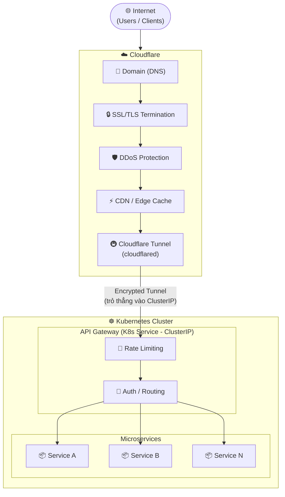

# 1. Tìm hiểu Ops và cách chia cluster
Do hệ thống thiên về AI nên tải sẽ không đều. Web/API có thể scale ngang, nhưng database, vector database, object storage và queue phải được thiết kế ổn định hơn. Tim hiểu cách chia cluster thành các lớp:
- Edge layer: load balancer, reverse proxy, rate limiting.
- Web/API layer: scale ngang nhiều replica.
- AI worker layer: xử lý LLM, tutor, guardrails.
- RAG worker layer: parse tài liệu, embedding, indexing.
- Data layer: PostgreSQL, vector DB, object storage, Redis/queue.
- CI/autograding layer: tách riêng để việc chạy test code sinh viên không ảnh hưởng hệ thống chính.
- Monitoring layer: log, metrics, tracing, alert.

Mục tiêu là xác định service nào cần scale ngang, service nào cần chạy ổn định/high availability, service nào nên xử lý bất đồng bộ qua queue.

## 1.1. Context
- Giả định hệ thống chạy trên server, chỉ giới hạn cho sinh viên trong trường sử dụng.
- Ứng tính quy mô:
    - Khi cao điểm có thể có khoảng 2000-3000 user active, 200-300 req/s.
    - Database: khoảng vài chục GB, chủ yếu là tài liệu, embedding và user info.
    - Trước mắt triển khai trên 3 môn học pivot là Học máy, Học sâu và Khai phá dữ liệu lớn.
## 1.2. Kiến trúc hệ thống
### 1.2.1. Layer 1: Tầng mạng

